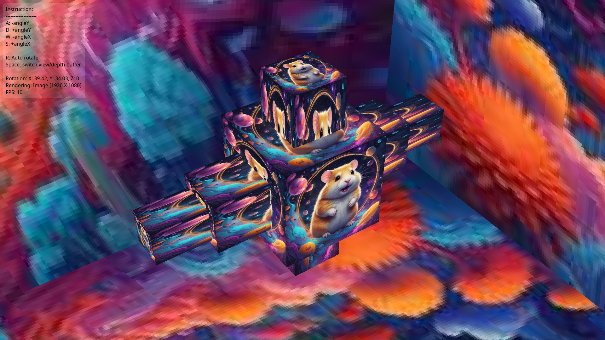

# xmax-gl

## Info

Software renderer.


### Update #1 Textures + Depth map preview


### Update #2 High resolution btw



## Install and run


### [Install bun](https://bun.sh)

```shell
bun install
bun start
```